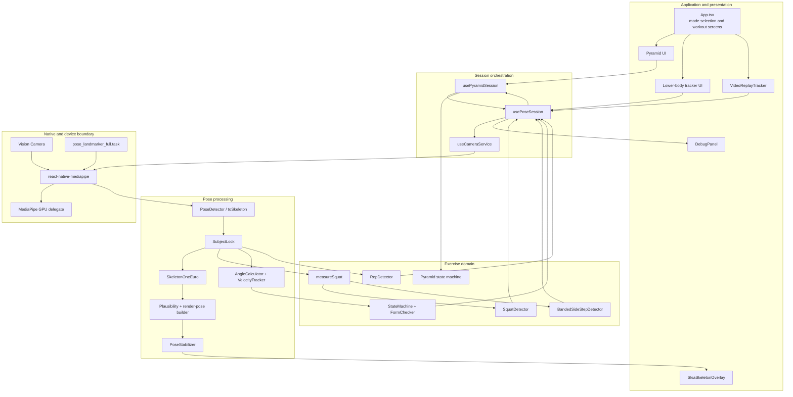
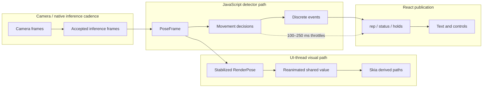

# System Architecture

## Architectural style

The project is a client-only, layered mobile module. Native camera and MediaPipe code produce pose landmarks; TypeScript services convert them into domain data; stateful detectors interpret movement; Reanimated shared values carry high-frequency visual signals; React state carries low-frequency UI events. `App.tsx` composes these pieces into the extracted application shell.

There is no server-side runtime tier. “Infrastructure” in this architecture means the device camera/GPU, bundled model assets, generated native projects, Metro, and EAS build profiles.

## Component view

## Major components and responsibilities

| Component | Responsibility | Important boundary |
|---|---|---|
| `App.tsx` | Selects the active exercise, renders the live camera UI, starts/stops lower-body sessions, and opens developer replay | This is the complete navigation layer in the shell; no routing library is used |
| `usePoseSession.ts` | Owns the frame pipeline, detector instances, session lifecycle, coaching, performance sampling, and public workout state | Central integration point and largest source file; high coupling is a maintainability concern |
| `CameraService.ts` | Configures MediaPipe LIVE_STREAM mode, model, GPU delegate, confidence thresholds, FPS target, permissions, and output orientation | Native bridge behavior is delegated to `react-native-mediapipe` |
| `PoseCamera.tsx` | Uses a measured Android camera profile and the stock MediaPipe camera component on iOS | Platform behavior intentionally differs |
| `PoseDetector.ts` | Maps 33 MediaPipe landmarks into view-space, normalized, world-space, visibility, and foot-specific structures | View conversion comes from the bridge's `ViewCoordinator` |
| `SubjectLock.ts` | Rejects abrupt subject position/scale changes and relocks after sustained absence | It is continuity filtering, not multi-person identity recognition |
| `oneEuro.ts` | Smooths view-space joints for display | Not used for high-velocity lower-body decisions |
| `plausibility.ts`, `skeleton.ts` | Select drawable data, reject implausible geometry, and infer limited arm geometry | Affects display; does not declare exercise correctness |
| `PoseStabilizer.ts` | Holds, fades, and caps motion of drawn joints | The rendered pose may intentionally lag or hold while detector inputs remain raw |
| `RepDetector.ts` | Learns a push-up extension envelope and counts top→bottom→top oscillations | Drives the visible push-up count |
| `StateMachine.ts`, `FormChecker.ts` | Track phase transitions and accumulate push-up form-rule outcomes | Run in parallel with the visible push-up counter |
| `squatMetrics.ts` | Builds scale-normalized lower-body measurements from raw landmarks | Jump mode can accept one visible side; other lower-body modes require both |
| `SquatDetector.ts` | Counts standard/pulse/jump variants and times bottom holds | Timestamp-based jump evidence avoids frame-rate assumptions |
| `BandedSideStepDetector.ts` | Counts lateral lead steps, rearms after trailing-foot recovery, times low holds, and measures step travel | Shoulder-width distance is primary; centimetres are optional estimates |
| `usePyramidSession.ts` | Adds set targets, rests, celebrations, and completion around discrete push-up events | Does not own pose detection or rep correctness |
| `VideoReplayTracker.tsx` | Samples a local clip and serially reuses the live pipeline with video timestamps | Development-only and capped at one minute |

## Frame and domain contracts

### `PoseFrame`

`src/pose-module/types.ts` defines the canonical detector frame:

- `skeleton`: view-space pixels aligned to the preview.
- `normalized`: MediaPipe image coordinates, generally within `[0, 1]`.
- `world`: optional body-relative 3-D coordinates from MediaPipe.
- `visibility`: per-joint presence/visibility confidence.
- `feet`: heel and foot-index landmarks kept separate from the rendered 18-joint skeleton.

Keeping the foot extension separate is deliberate: jump detection can use the lowest trustworthy point without allowing the general rendering and form code to acquire an accidental dependency on optional points.

### `RenderPose`

The overlay receives ordered points with `show`, `alpha`, and `uncertain` state. This is a presentation contract, not a copy of raw model output. It encodes held, inferred, fading, and confidence-limited points so the Skia layer can remain simple.

### Exercise state

`usePoseSession` exposes three parallel state families:

- A generic `repCount` and optional `PoseSession` completion object.
- `SquatTrackingState`, including variant counts, holds, status, and optional jump diagnostics.
- `BandedSideStepTrackingState`, including directional counts, holds, step history, and distance aggregates.

The hook also exposes a `PushUpSignal` of Reanimated shared values for game consumers. In this shell those games are not mounted, but the contract remains part of the pose engine.

## Execution and update boundaries

This boundary is a central performance decision:

- Camera and model cadence can vary by device and active profile.
- The skeleton is not placed into React state per frame. Skia reads derived paths from a shared value.
- Coaching publishes at most four times per second, debug data roughly 6–7 times per second, and lower-body state at most every 100 ms unless a discrete step, rep, or completed hold occurs.
- The Android native patch accepts a frame only while no inference is in flight, favoring freshness over completeness.

## Rendering architecture

The visual and detector paths intentionally diverge after subject lock:

1. View-space joints pass through a One Euro filter.
2. Plausibility checks reject scattered skeletons and demote impossible leg joints.
3. `PoseStabilizer` holds a missing joint, fades it after a grace period, and rate-limits position jumps.
4. The resulting `RenderPose` is written to a shared value.
5. iOS uses detailed per-bone gradients and joint outlines; Android batches skeleton and joint geometry into two main paths and omits the orange outline.

Meanwhile, raw view/world landmarks feed the movement metrics. A fast jump therefore is not flattened merely to make its overlay smoother.

## Dependency direction

The public module entry point (`src/pose-module/index.ts`) exposes session hooks and domain types. Exercise configurations depend on generic contracts in `types.ts`; detector classes depend on configurations and metric types; screens depend on hooks. The game source depends only on the `PushUpSignal`/event interface in design, but its renderers also reference missing host-application assets and services.

There is no formal dependency-injection layer. Stateful collaborators are instantiated as React refs inside `usePoseSession`, which makes the hook self-contained but concentrates construction, lifecycle, branching, and publication in one file.

## Trust boundaries

The code establishes functional—not security—boundaries:

- Model output is treated as untrusted movement evidence and filtered through confidence, plausibility, subject continuity, thresholds, and state machines.
- Camera and replay frames cross a native dependency boundary in `react-native-mediapipe`.
- No runtime application network boundary is implemented.
- Diagnostic traces contain derived numeric fields and status text, not raw images or landmark arrays, when the trace is explicitly enabled.

The repository contains no threat model, dependency audit, encryption design, or compliance evidence; none should be inferred from on-device processing alone.
