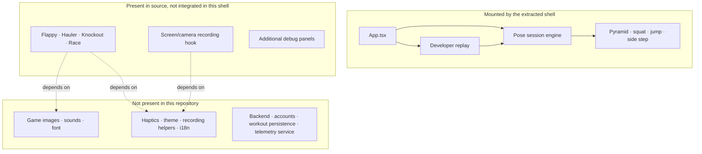

# Context & Capabilities

## Problem and purpose

Camera-based exercise tracking is not only a landmark-detection problem. A usable mobile tracker must also decide which person to follow, tolerate short occlusions, normalize for the athlete's distance from the phone, reject ordinary movement that resembles an exercise signal, avoid delayed feedback when inference falls behind, and present a skeleton that does not flicker even when the detector is uncertain.

This project addresses that combined problem for a small set of bodyweight and banded movements. Its purpose is to turn a front-camera pose stream into immediate, on-device workout feedback while keeping the core detector reusable across a simple tracker, a set-sequencing mode, developer replay, and—in the larger source from which this shell was extracted—game renderers.

The current shell is best understood as a pose-engine integration and validation application. It contains a real native camera path, detector logic, workout UI, and EAS build configuration, but not the surrounding product services of a full fitness application.

## Main features

### Live feedback and coaching

The app requests camera permission, shows a front-camera preview, and draws a stick-figure overlay. Coaching state distinguishes no body, excessive proximity, invalid pre-start positioning, ready, go, counting, and tracking loss. Coaching transitions are debounced and React publication is throttled so transient confidence dips do not flash copy on screen (`src/pose-module/hooks/usePoseSession.ts`).

### Push-up pyramids

The user chooses level 3, 4, or 5. A level *N* workout produces the set sequence `1 … N … 1`, for *N²* total repetitions. The orchestration layer accepts a repetition during the short set-complete or rest phase as an early start for the next set. It intentionally has no inactivity timeout. See `src/pose-module/pyramid/pyramid.ts` and `src/pose-module/hooks/usePyramidSession.ts`.

### Squats, pulses, jumps, and holds

The standard squat detector differentiates a full squat from a bottom-range pulse and records stable bottom holds. Jump mode uses a timestamp-driven progression from a loading squat through takeoff and an airborne arc to descent. It can accept one well-tracked side for side-view jump clips, while ordinary squats and side steps require both sides. See `src/pose-module/squats/SquatDetector.ts` and `src/pose-module/squats/squatMetrics.ts`.

### Banded side steps

The detector requires a low athletic stance, counts the leading foot moving outward, then waits for the trailing foot to catch up before rearming. Anatomical left/right is derived independently of preview mirroring. The current detector also tracks the greatest lead-foot travel reached during each step in shoulder-width units and optionally derives approximate centimetres from MediaPipe world landmarks. See `src/pose-module/side-steps/BandedSideStepDetector.ts`.

### Developer video replay

In development builds, a user can choose a local video up to 60 seconds. The replay tool samples thumbnails every 50 ms, runs MediaPipe IMAGE mode serially, and passes original video timestamps into the same `onResults` pipeline used by the live camera. This makes time-based detector decisions independent of how quickly a device decodes the clip. The feature is explicitly labeled as a developer tool in `src/pose-module/screens/components/VideoReplayTracker.tsx`.

### Performance adaptation

Android starts with a 1280×720 camera profile. After a warm-up, measured inference latency and processed-frame rate may cause a one-way downgrade to 960×540 or 640×480 and lower inference targets. Android also uses a batched, lower-detail Skia overlay. The native MediaPipe patch rejects incoming frames while inference is in flight so old frames cannot form a queue.

## Primary use cases

| User or role | Supported use case | Boundary |
|---|---|---|
| Athlete or tester | Complete a guided push-up pyramid in front of a phone | No account, history, or cloud synchronization |
| Athlete or tester | Count standard squats, pulse squats, jump squats, and bottom holds | Lower-body form scoring is not implemented |
| Athlete or tester | Count left/right banded side steps and low-squat holds | Distance in centimetres is approximate |
| Developer or QA | Replay a short local clip repeatedly while tuning a detector | Development-only entry point; serial processing is not real-time playback |
| Developer or QA | Inspect local inference, confidence, counter state, and bounded numeric traces | Debug HUD is compile-time disabled by default; no remote telemetry |
| Integrating application | Consume `usePoseSession`, `usePyramidSession`, and exported tracking types | The repository is not packaged or versioned as a standalone library |

## Actual repository boundary

### Implemented and reachable

`App.tsx` mounts only the camera trackers and developer replay. `src/pose-module/index.ts` exposes the two main hooks plus domain types for an integrating application. Expo configuration includes the camera, image-picker, video, and model-copy plugins required by these mounted paths.

### Present but not integrated

The `src/pose-module/games/` directory contains game engines, renderers, end screens, and pure-logic tests. The shell does not import them. Their UI source refers to fonts, images, sound files, haptics, translation functions, and application helpers that are not present. Likewise, `useVideoRecordingSession.ts` refers to recording helpers and a camera component absent from this extraction. These files show design intent and reusable logic; they are not current shell features.

### Explicitly absent

There is no runtime application API client, authentication layer, database, analytics SDK, crash-reporting SDK, or remotely managed configuration in the tracked source. The only `fetch` call in the repository is the developer script that downloads a MediaPipe model before a native build (`scripts/fetch-mediapipe-model.mjs`). This code search supports a narrow statement about the application source; it is not a security audit of transitive native dependencies.

## Success criteria implied by the implementation

The code emphasizes qualitative invariants rather than product-level service objectives:

- Use the newest available frame instead of building a latency queue.
- Keep exercise counters responsive even when the displayed skeleton is smoothed.
- Preserve a repetition count through a short loss of tracking.
- Make lateral direction robust to camera mirroring.
- Avoid one-frame skeleton blinking and implausible limb placement.
- Normalize motion signals by body scale where practical.
- Keep diagnostic traces bounded and free of raw frames or landmark arrays.

No accuracy percentage, supported-device matrix, latency service level, medical claim, or production usage metric is defined in the repository.
