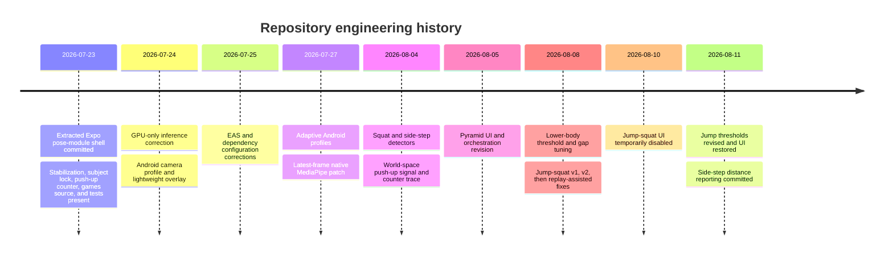

# Engineering Evolution

## Basis of this history

The repository contains 13 commits from 23 July through 11 August 2026. This section reports only changes visible in those commits or in issue-oriented comments and tests preserved in the source. It does not reconstruct conversations that are absent from the repository.

The latest commit reviewed is `3a24c40`, which adds side-step distance measurement to live and replay output.

## Change timeline

## Debugging and refactoring work

### Preventing a false GPU-to-CPU fallback

The original camera service used a watchdog that interpreted an absence of pose results as a failed GPU delegate and switched to CPU. The native bridge emits results only when it finds a pose; an empty frame therefore was not proof of delegate failure. Commit `8d90a28` removed this watchdog, fixed the delegate to GPU, and moved frame-rate control into the detector configuration.

The same change constrained Android capture to a 720p profile and introduced a lower-cost overlay. The explicit engineering goal in the diff was to avoid spending camera/GPU and UI budget on an unnecessarily high-resolution preview and per-limb effects.

**Current status:** GPU-only inference remains implemented. Initialization errors surface in the UI, but there is no CPU recovery path.

### Favoring current frames over complete frame processing

Commit `b3df8e2` added a pnpm patch for `react-native-mediapipe@0.6.0`. An atomic `inferenceInFlight` flag prevents the frame processor from submitting a new asynchronous MediaPipe job while the previous job is active. The flag resets on successful, empty, and error callbacks.

This changes the overload policy from queueing work to dropping intermediate camera frames. The user sees newer pose data at the cost of analyzing fewer frames—a better trade for interactive exercise feedback.

The same commit expanded Android performance profiles to high/mid/low tiers and added measured, downgrade-only selection. It also reduced React update pressure by throttling coaching state.

**Current status:** the patch is active through `pnpm-workspace.yaml`. It creates a maintenance dependency on the precise native package version.

### Separating visual smoothness from movement responsiveness

The source preserves several issue-oriented fixes around skeleton quality:

- `SubjectLock` rejects a pose that teleports or abruptly rescales and relocks after sustained absence.
- `PoseStabilizer` replaces hard disappearance with hold-then-fade behavior and caps single-frame position jumps.
- Leg plausibility detects impossible projected bone lengths or lower joints inside the torso polygon and fades those segments.
- Low-confidence or inferred joints are visually marked as uncertain internally, with the optional glow disabled by default.

When lower-body exercises were added, the frame pipeline explicitly kept One Euro filtering on the render branch while feeding raw landmarks to squat/jump/side-step metrics. This refactor avoids delaying high-velocity takeoff and lateral travel signals.

**Current status:** covered by unit tests for stabilizer, subject lock, leg plausibility, skeleton inference, and uncertainty behavior.

### Replacing view-dependent push-up evidence

The source comments document two field failures. Elbow confidence can collapse at the bottom of a push-up, and a phone placed on the floor facing the athlete can make torso orientation and 2-D vertical motion misleading. The implemented response was:

1. Use MediaPipe world-space shoulder-to-wrist extension when available.
2. Keep the earlier 2-D shoulder-to-wrist vertical gap as a fallback.
3. Count with an adaptive depth envelope instead of fixed elbow thresholds.
4. Use an upright-body veto based on leg span rather than torso angle.
5. Reset the learned signal while wrists are traveling to reject crawling/approach motion.

Commit `87233c4` added world-arm tests and the world-coordinate pipeline work alongside the lower-body features.

**Current status:** the adaptive counter drives the display. The older phase machine remains for phase/form output, creating two concurrent interpretations of a push-up cycle.

### Making lower-body tracking tolerant but bounded

The first committed lower-body implementation (`87233c4`) introduced dedicated squat and side-step detector classes, explicit user-facing status, timed holds, and an 800 ms shared tracking-gap allowance. Commit `1178a49` then revised thresholds and tests after ordinary phone-facing squats were not reliably reaching deep, side-view-style angle values.

For side steps, the detector derived outward direction from anatomical ankle ordering instead of a hard-coded screen direction. The rearm condition was also decoupled from a fixed baseline stance: the trailing foot may catch up even when band tension leaves the new stance slightly wider.

**Current status:** standard/pulse squat and side-step pure logic is tested. Physical-device accuracy is not quantified in the repository.

### Iterating jump squats with better evidence

Jump squats went through four implementation commits across 8 August (`ef23b6a`, `c9b528c`, `6ab7d41`) and 11 August (`44b18a1`), with a temporary UI withdrawal on 10 August (`98f0ded`). The iterations progressively added or refined:

- Heel and foot-index landmarks so an ankle spike cannot decide a jump alone.
- Body-relative world landmarks and numeric, opt-in jump diagnostics.
- A Heavy-model benchmark path while keeping Full as the release default.
- Timestamp-based takeoff and landing evidence instead of frame counts.
- Short-gap preservation and event-specific timeout handling.
- One-visible-leg support for side-view clips, coupled with pelvis motion.
- Developer video replay using the same model, thresholds, and pipeline as live tracking.
- A takeoff window that retains the grounded baseline briefly after apparent knee extension.
- Separate jump loading depth and repetition debounce thresholds.

The UI was hidden while tuning, then restored after the final threshold/test revision. Comments in both UI files still describe jump squats as being tuned, which is useful evidence that the feature should be treated as recently stabilized rather than broadly validated.

### Normalizing live and replay behavior

The replay work uncovered a bridge difference: Android IMAGE mode can reject a valid frame with a “no pose” error, while the live stream represents absence as an empty callback. The replay wrapper converts only recognized no-pose errors into an empty result and passes all other errors to the UI. Original clip timestamps are used for time-dependent decisions, avoiding false behavior caused by slow decoding.

**Current status:** the replay tool is available behind `__DEV__`, samples at 20 frames per second, and caps clips at 60 seconds.

### Adding side-step distance measurement

Commit `3a24c40` extends `BandedSideStepDetector` with per-step maximum travel, history, average, and longest distance. Relative distance is frozen to the shoulder-width baseline established at step start. If world shoulder width is available, the UI shows an approximate centimetre value in both live and replay modes.

The same commit expands tests to cover first-step timing and maximum-distance updates. Those tests pass in the verification baseline for this paper.

## Issue-to-resolution matrix

| Observed or documented issue | Evidence in repository | Implemented response | Remaining caveat |
|---|---|---|---|
| No-pose frames triggered slow CPU mode | `8d90a28`, `CameraService.ts` comments | Removed result watchdog; fixed GPU delegate | No runtime CPU fallback for genuinely incompatible GPU devices |
| Full-model processing accumulated latency | `b3df8e2`, native patch | Accept only the latest frame when inference is free | Drops frames by design; patch must track dependency internals |
| Android preview/overlay consumed too much budget | `performanceProfile.ts`, `PoseCamera.tsx`, overlay comments | Adaptive resolution/FPS and batched Android drawing | Quality only downgrades during a mounted session |
| Skeleton blinked or jumped on weak detections | `PoseStabilizer.ts`, related tests | Hold, fade, capped travel, inferred alpha | Visual pose intentionally differs from raw detector pose |
| Detector could switch to a background shape | `SubjectLock.ts`, tests | Shoulder position/scale continuity lock | Single-person continuity heuristic, not identity tracking |
| Elbows disappeared at push-up bottom | `geometry.ts`, `repDetector.ts` | Arm-extension signal and adaptive envelope | Count and form phase machines can disagree |
| Floor-facing camera made torso-angle setup unreliable | `posture.ts`, `pushup.config.ts` | Leg-span upright veto | Depends on usable knee or ankle landmarks |
| Squat thresholds missed ordinary phone-facing form | `1178a49`, source comments | Relaxed angle/confidence thresholds and gap preservation | No dataset-level accuracy report |
| Mirroring swapped lateral direction assumptions | side-step tests/comments | Derive direction from current anatomical ordering | Still requires two-sided lower-body visibility |
| Jump evidence was fragile to foot jitter, occlusion, and variable FPS | jump commit series | Heel/toe evidence, pelvis corroboration, one-side mode, timestamp states | Recently tuned; physical-device matrix absent |
| Offline replay stopped on an empty-pose frame | `6ab7d41`, `isNoPoseImageError` | Normalize recognized errors to empty results | Error classification is message-pattern based |
| Detector initialization failed silently | `usePoseSession.ts` comments | Publish `initError` to workout/replay UI | No remote crash or error collection |

## Refactoring pattern

Across the history, the dominant pattern is extraction of explicit state and contracts from per-frame UI code:

- Camera policy moved to `CameraService`, `PoseCamera`, and `performanceProfile`.
- Movement rules moved to `RepDetector`, `SquatDetector`, and `BandedSideStepDetector`.
- Pyramid timing moved to a dedicated orchestration hook and pure helpers.
- Coordinate mapping moved to `PoseDetector` and a replay-specific coordinator.
- Performance and counter diagnostics moved into bounded utility classes.

The next logical refactoring boundary is the still-monolithic `usePoseSession`, which currently assembles every collaborator and owns all exercise branches.
