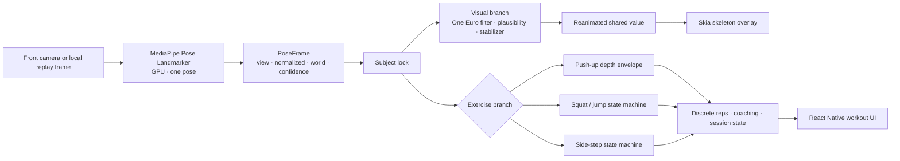

TECHNICAL WHITE PAPER · VERSION 1.0

# BeFirst Pose Module

## An on-device, camera-driven exercise tracking engine for React Native

This paper describes the current implementation, the engineering decisions that shaped it, and the work required to turn the extracted module into a production-ready subsystem.

Repository state reviewed 11 August 2026

## Executive summary

The BeFirst Pose Module is a portrait-oriented Expo/React Native application shell that performs single-person pose estimation on a physical iOS or Android device. It converts MediaPipe landmarks into a stabilized Skia skeleton, exercise-specific movement signals, repetition and step counts, timed holds, coaching messages, and developer diagnostics. The mounted application currently exposes four workout modes: push-up pyramids, squats (including pulse detection), jump squats, and banded side steps. A developer-only recorded-video replay path runs the same detector pipeline over sampled local frames.

The system is intentionally device-centric. Camera frames feed the native MediaPipe bridge with a GPU delegate; no application backend, user account, remote workout store, or runtime upload path exists in this repository. Performance work focuses on avoiding inference backlog, keeping high-frequency pose values out of React state, batching Android drawing, and lowering camera/inference load when measured device performance degrades.

The most important architectural strength is the separation of concerns inside the per-frame pipeline. Raw landmarks drive movement decisions, while a filtered and temporally stabilized copy drives the skeleton overlay. That separation avoids trading detector responsiveness for visual smoothness. Exercise detectors also operate on scale-normalized signals—usually shoulder-width units—and preserve state through bounded landmark gaps.

The repository is nevertheless an extracted development shell, not a complete product. Mini-game and recording source remains in the tree but depends on assets and application services that are absent and is not mounted by `App.tsx`. Native projects are generated and Git-ignored. Test coverage is strong for pure detector logic (244 Jest tests passed during this review), but there is no checked-in CI workflow, device-level automated test suite, remote observability, or full-source TypeScript check. Several outputs also need product clarification: lower-body session form results are placeholders, push-up display counts and form-summary cycles are produced by different mechanisms, and side-step centimetres are estimates rather than calibrated measurements.

## What the current codebase delivers

| Capability | Current implementation | Primary source |
|---|---|---|
| Live pose inference | MediaPipe Pose Landmarker, one pose, GPU delegate, full model | `src/pose-module/services/CameraService.ts` |
| Visual feedback | Confidence-aware skeleton rendered with Skia through Reanimated shared values | `src/pose-module/screens/components/SkiaSkeletonOverlay.tsx` |
| Push-up tracking | World-space arm extension with a 2-D fallback and an adaptive oscillation counter | `src/pose-module/geometry.ts`, `src/pose-module/repDetector.ts` |
| Pyramid workouts | Levels 3, 4, and 5; ascending and descending set sequence with timed transitions | `src/pose-module/hooks/usePyramidSession.ts` |
| Squat tracking | Standard reps, bottom-range pulses, and bottom holds | `src/pose-module/squats/SquatDetector.ts` |
| Jump-squat tracking | Loading, takeoff, airborne arc, and descent state detection | `src/pose-module/squats/SquatDetector.ts` |
| Banded side steps | Mirroring-independent left/right steps, low-squat holds, relative distance, and approximate metric distance | `src/pose-module/side-steps/BandedSideStepDetector.ts` |
| Repeatable developer analysis | Local video selection and serialized 20 Hz frame replay for clips up to 60 seconds | `src/pose-module/screens/components/VideoReplayTracker.tsx` |
| Adaptive Android performance | High/mid/low camera and inference profiles; downgrade-only selection | `src/pose-module/performanceProfile.ts` |
| Local diagnostics | Throttled FPS/inference data and an opt-in, bounded numeric counter trace | `src/pose-module/perfMetrics.ts`, `src/pose-module/counterTrace.ts` |

## System in one view

## Evidence and interpretation

This paper uses the current repository state as its primary evidence and Git history only to describe prior debugging and refactoring. The latest source commit reviewed is `3a24c40` (`side steps distance added`); documentation changes themselves remain outside that source commit.

The labels below are used throughout:

- **Implemented** means the behavior is reachable from the current `App.tsx` or directly supports that path.
- **Present but not integrated** means source exists but the shell does not mount it or its dependencies are missing.
- **Historical** means the statement is supported by the repository's Git commits or preserved issue-oriented tests/comments.
- **Recommendation** means a proposed improvement, not current behavior.

No benchmark values in this paper should be read as measured product performance. Thresholds in source code are control values and promotion gates, not evidence that any particular phone achieved them.

## White-paper map

- [Context & Capabilities](context-and-capabilities.md) defines the problem, purpose, use cases, and actual product boundary.
- [System Architecture](architecture.md) describes components, execution boundaries, and ownership.
- [Data Flows & Workflows](workflows.md) traces live inference, exercise counting, pyramids, and replay.
- [Engineering Evolution](engineering-history.md) reconstructs the debugging and refactoring history.
- [Technology & Data](technology-and-data.md) records the stack, data contracts, and data boundary.
- [Operations & Quality](operations.md) covers development, tests, deployment, performance, and observability.
- [Decisions & Trade-offs](decisions.md) captures the architectural choices visible in code.
- [Limitations & Roadmap](limitations-and-roadmap.md) separates current debt from recommended next work.

!!! note "Review baseline"
    On 11 August 2026, `pnpm typecheck` completed successfully and `pnpm test` reported 28 passing suites and 244 passing tests. The [quality section](operations.md#verification-baseline) explains the important coverage boundaries behind those results.
