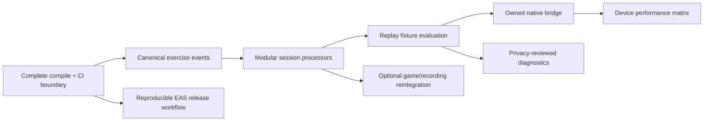

# Limitations & Roadmap

## Current limitations and technical debt

### Product and integration boundary

The repository is an extracted shell. It does not include navigation beyond local mode state, user accounts, workout history, persistence, synchronization, localization, a backend, or product analytics. Game and recording code remains in the tree but cannot be mounted without the absent images, audio, font, haptics, theme, translation, and recording helpers described in `RUNNING.md` and the imports themselves.

This is a scope fact, not a defect in the pose algorithms. It becomes technical debt when dormant source is mistaken for compiled/shipped capability or remains outside routine type checking.

### Session and domain semantics

- Push-up display counts come from `RepDetector`, while push-up form `RepResult` objects come from a separate phase machine. A completed session summary is built from `repHistory`, so its total can theoretically diverge from the number shown during the workout.
- Squat and side-step events insert placeholder `RepResult` objects with `isValid: true`, `formScore: 100`, and no violations. Those values do not represent implemented lower-body form assessment.
- `PoseSession.duration` uses wall-clock time. Replay passes a source timestamp into detector finalization, but the generic session duration remains based on execution time if a caller consumes it.
- Holds and step histories are stored in unbounded arrays for the session duration.

### Detector maturity

- Jump squats were hidden for tuning on 10 August and restored on 11 August. Comments still mark them as being tuned; no accuracy corpus or supported-device matrix is checked in.
- Side-step centimetres are inferred from MediaPipe world shoulder width. They are explicitly approximate and should not be presented as calibrated distance.
- Side steps and ordinary squats require visibility for both lower-body sides. Crowded backgrounds, loose clothing, camera placement, and long occlusion are not characterized by a repository dataset.
- A single-pose subject lock protects continuity but does not identify a person or support group workouts.
- IMAGE-mode no-pose handling depends on matching error-message text from the native bridge.

### Build and dependency debt

- `react-native-mediapipe@0.6.0` is patched at the native Kotlin source level. The repository itself describes the public package as old and suggests a private fork may have existed in the original application.
- Native projects are ignored and regenerated. Any manual native fix is easy to lose unless moved into a plugin or patch.
- The Full model and the much larger Heavy model are both tracked. Asset selection is split across a compile-time constant, a fixed Full-model config plugin, and a benchmark fetch script.
- `eas.json` contains only basic build profiles. No CI, store submission, signing runbook, environment schema, or release verification workflow is checked in.

### Quality-system debt

- `tsconfig.json` includes a narrow list rather than the full source tree. Dormant UI and integration code can escape TypeScript verification.
- There is no lint or format script.
- Jest tests run in Node and do not exercise the native camera, GPU delegate, frame processor, Skia output, permissions, or Expo prebuild.
- There is no automated device/replay fixture suite, end-to-end test harness, accuracy evaluation set, or regression report.
- The current repository has no `AGENTS.md` or other checked-in contributor guidance.

### Observability and operations debt

- Performance, confidence, and counter traces are local, in memory, and usually hidden.
- There is no crash/error aggregation or opt-in diagnostic export on the mounted shell.
- “Dropped percentage” is derived from a target because delivered camera-frame counts are unavailable; it is not a true dropped-frame measure.
- Heavy-model promotion thresholds exist, but there is no automated benchmark runner, results archive, or device cohort policy.

### Maintainability debt

- `usePoseSession.ts` is approximately 850 lines and owns collaborator construction, live/replay processing, exercise branching, performance policy, coaching, session output, and React publication.
- UI feature flags for jump squats are duplicated between `App.tsx` and `VideoReplayTracker.tsx`.
- Exercise identifiers are strings repeated across the app, registry, hook branches, and replay list.
- Some source comments refer to specifications or a `no-git-docs/doc.pdf` that is not present, leaving part of the design rationale inaccessible.
- Additional debug panels and recording code import host-application modules not in the extraction.

## Recommended improvement sequence

Everything below is a recommendation, not current implementation.

### 1. Establish one verifiable build boundary

1. Expand TypeScript configuration to cover every intended source file.
2. Either restore dependencies for retained games/recording or move them behind a separately compilable package/example boundary.
3. Add linting/formatting and a CI workflow that runs type checking, Jest, `git diff --check`, and `mkdocs build --strict`.
4. Keep generated `site/` output out of source review unless a publishing workflow explicitly needs it.

**Why first:** a complete compile/test boundary prevents dormant code and documentation from drifting while detector work continues.

### 2. Define a canonical exercise-event model

Introduce a single event contract that gives each rep/step an ID, detector timestamp, exercise variant, primary signal summary, optional form evaluation, and hold/distance attachments. Reconcile the push-up adaptive counter with form phases at that boundary. Represent unavailable form scoring as unavailable—not `100`.

**Expected result:** UI count, callbacks, saved summaries, replay output, and future games refer to the same exercise events.

### 3. Modularize the session pipeline

Split `usePoseSession` into testable stages:

- Frame admission/mapping and subject continuity.
- Render-pose production.
- Push-up processor.
- Lower-body processor.
- Performance controller.
- React publication/session lifecycle adapter.

Use a typed exercise registry for IDs, detector factory, UI label, replay availability, and feature maturity. This would remove duplicated flags and reduce branch coupling without changing the hot-path architecture.

### 4. Create an evidence-based detector validation harness

Build a consented, versioned set of short clips or derived landmark fixtures covering camera angles, body sizes, clothing, lighting, occlusion, mirrored output, repetition speed, and negative movements. Run the same source timestamps through the shared replay path and report false positives, false negatives, count deltas, and state traces per detector/version.

Do not set accuracy targets before the corpus and labeling protocol are defined. The repository currently provides no basis for inventing such metrics.

### 5. Retire or own the native patch

Evaluate a maintained upstream release or establish a project-owned fork with:

- The latest-frame admission behavior.
- Explicit empty-result and delegate-error contracts.
- Delivered/accepted/dropped frame counters.
- Automated Android native tests.
- A documented upgrade and release process.

This reduces reliance on upstream source layout and replaces message-pattern error handling with typed events.

### 6. Improve device performance policy

Persist a coarse, versioned device/model benchmark result locally, revalidate after material app/model changes, and consider a guarded upward recovery only between sessions. Add a device test matrix for camera formats, thermal behavior, and GPU errors. Keep model switching outside active workouts.

### 7. Add privacy-conscious operational diagnostics

Provide an explicit, opt-in export of derived trace/performance data with a schema and redaction review. If remote crash/performance reporting is later introduced, exclude frames and raw landmark streams by default, document retention, and distinguish inference failures from “no person present.”

### 8. Productionize deployment

Add a reproducible release workflow around Expo prebuild and EAS: pinned toolchain expectations, credentials ownership, build-number policy, preview acceptance checks, store submission configuration, rollback policy, dependency/model provenance, and artifact verification. None of these should be claimed until implemented and exercised.

### 9. Reintegrate optional experiences deliberately

After the core boundary is healthy, decide whether Flappy, Hauler, Knockout, Race, and video recording belong in this package. If yes, restore assets/services with license provenance and make each experience consume the canonical exercise-event/signal contract. If no, remove or archive the incomplete integration source while preserving pure mechanics that still have value.

## Opportunity map

## What should not be optimized prematurely

- A cloud backend is not required to improve detector correctness or local testability.
- Heavy-model promotion should not precede representative device and accuracy evidence.
- Remote threshold configuration should not precede a canonical event model and rollback discipline.
- More visual effects should not compromise the current shared-value/batched rendering boundary.
- Calibrated physical distance should not be inferred from world landmarks alone; it requires an explicit measurement design and validation protocol.
