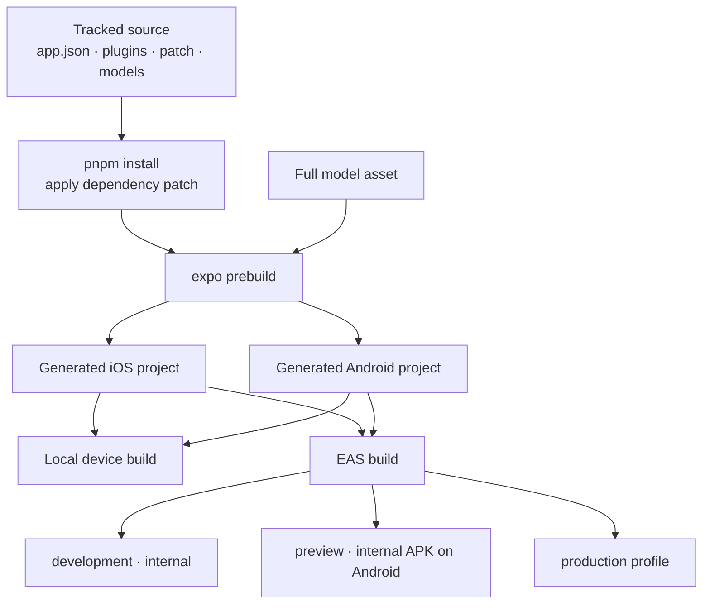

# Operations & Quality

## Local development

### Prerequisites

- Node.js 22 LTS is the repository's documented safe choice. `RUNNING.md` warns that Node 25 may cause Expo problems.
- pnpm, matching the committed lockfile/workspace.
- Xcode and CocoaPods for iOS, or Android Studio/SDK for Android.
- A physical device. The camera workflow is not useful on the iOS simulator and is described as unreliable on Android emulators.
- Python 3 and the documentation dependencies only if building this white paper.

This is not an Expo Go application. MediaPipe, Vision Camera, Skia, Reanimated, and worklets require a native development build.

### First native run

=== "iOS"

    ```bash
    pnpm install
    pnpm run fetch:model
    pnpm ios
    ```

=== "Android"

    ```bash
    pnpm install
    pnpm run fetch:model
    pnpm android
    ```

After installing a development build, start Metro with:

```bash
pnpm start
```

`pnpm run prebuild` regenerates native projects from Expo configuration. The `ios/` and `android/` directories are Git-ignored, so changes made directly inside them are not durable unless captured in an Expo config plugin or dependency patch.

### Model prerequisites

The default build expects `models/pose_landmarker_full.task`. `pnpm run fetch:model` downloads it from Google's MediaPipe model bucket if missing and copies it into the Android main asset directory. The Expo config plugin adds the same file to iOS resources and copies it during Android prebuild.

The developer Heavy-model path is manual:

```bash
pnpm run benchmark:model:heavy
```

Fetching the file does not change the compile-time `POSE_MODEL_TIER`; a benchmark build must deliberately coordinate that constant and platform assets. There is no supported runtime selector.

### Build the white paper

Create an isolated Python environment and serve the site locally:

```bash
python3 -m venv .venv-docs
source .venv-docs/bin/activate
python3 -m pip install -r requirements-docs.txt
mkdocs serve
```

Run the strict production build with:

```bash
mkdocs build --strict
```

The generated `site/` directory is explicitly Git-ignored and should not be committed unless a future publishing workflow deliberately changes that policy.

## Test and verification commands

```bash
pnpm typecheck
pnpm test
```

`pnpm test` runs Jest serially under a Node environment. The test match covers all `src/pose-module/**/__tests__/**/*.test.ts` files, including pose geometry, counters, state machines, stabilizers, lower-body detectors, model promotion logic, and pure mini-game mechanics.

## Verification baseline

The following checks were executed against the current working tree on 11 August 2026:

| Check | Result | What it proves | What it does not prove |
|---|---:|---|---|
| `pnpm typecheck` | Passed | Files in the explicit `tsconfig.json` include graph type-check under strict mode | The entire `src/pose-module` tree is not included |
| `pnpm test` | 28/28 suites; 244/244 tests passed | Pure logic and Node-compatible integrations match current expectations | Native camera/model integration, UI behavior, physical exercise accuracy, and device performance |
| `git diff --check` before documentation | Passed | Existing working-tree edits had no whitespace errors | Semantic correctness |

The narrow TypeScript include list is significant. It names `App.tsx`, the public entry point, two session hooks, pyramid logic, and a few UI components. Imports reachable from those files are checked, but retained game screens, recording integration, and additional debug panels can remain unchecked if they are not in the import graph.

## Suggested manual device validation

The repository has no checked-in device test protocol. Based on current detector branches, a minimally useful manual pass should cover:

1. Camera permission denied, granted, and granted after retry.
2. iOS and Android front-camera overlay alignment in portrait.
3. Subject leaving and re-entering frame without losing the cumulative count.
4. Standard and knee push-ups from front/45-degree/side views, including crawling toward the phone.
5. Standard squat, pulse, and stable bottom hold.
6. Jump squat from front and side views, including one occluded rear foot and short tracking gaps.
7. Mirrored and unmirrored left/right side steps, trailing-foot rearm, distance update, and low-squat loss.
8. Android high-to-mid/low downgrade behavior under load and thermal pressure.
9. Replay of empty-pose, short, one-minute, and malformed-duration clips.
10. MediaPipe model initialization failure with an actionable UI message.

This is a recommended validation outline, not evidence that the repository has already passed those scenarios.

## Infrastructure and deployment

### Expo prebuild boundary



`app.json` sets portrait orientation, dark UI, the React Native new architecture, an application scheme, iOS bundle identifier, Android package ID, camera permission text, image-library permission text, and the EAS project ID. The local model plugin and native-library plugins are part of the prebuild input.

`eas.json` declares:

- `development`: internal distribution.
- `preview`: internal distribution, with Android APK output.
- `production`: default EAS production behavior with no repository-specific overrides.

There is no checked-in submit profile, store-release automation, over-the-air update configuration, environment-variable schema, secrets manifest, CI workflow, or deployment runbook. The configuration proves that EAS builds are intended; it does not prove a production store release has occurred.

### Native dependency patch

`pnpm-workspace.yaml` applies `patches/react-native-mediapipe@0.6.0.patch` during installation. A successful native build therefore depends on pnpm honoring the patch and on upstream source remaining compatible with the patched package version. `RUNNING.md` explicitly notes that the public package is old and that the original application may have used a private fork.

## Scalability and performance

### Scaling model

There is no shared service to scale horizontally. Each device owns one camera, one pose model, one subject lock, and one workout session. Capacity is primarily constrained by per-device camera bandwidth, GPU inference time, JavaScript callback work, and UI rendering.

The code addresses that local capacity model through:

- One-pose inference (`numPoses: 1`).
- Latest-frame admission rather than queued inference.
- Lower idle inference targets and higher active targets.
- Measured Android high/mid/low profiles.
- A fixed-size performance sample buffer.
- Raw numeric state in refs/shared values rather than per-frame React renders.
- Batched Android Skia geometry.
- Serialized replay processing.

### Adaptive profiles

Every device begins at the high Android profile. After at least 36 samples, the evaluator considers p95 inference time and processed CV FPS every 12 processed frames. It may move to mid or low, but never back upward during the mounted hook's lifetime. This avoids oscillating camera formats mid-workout.

The thresholds in `performanceProfile.ts` are control rules, not reported field performance. The derived “dropped percentage” compares processed callbacks to a nominal target because the native wrapper does not expose total delivered camera frames.

### Scale limitations

- The model supports only one selected pose.
- Replay cost grows linearly with video duration and samples 20 images per second.
- The step-history array and hold arrays are not capped during a session, unlike performance and trace buffers.
- Performance adaptation is Android-specific; iOS uses static 20/30 inference targets and the stock MediaPipe camera component.
- No device capability cache persists a previously suitable tier.

## Observability

| Signal | Current location | Availability | Limitation |
|---|---|---|---|
| Instant inference time | `DebugInfo.inferenceMs` | Debug HUD only | Compile-time disabled by default |
| Rolling average and p95 | `PerfSnapshot` | In memory | Not exported or persisted |
| Processed CV FPS | `useFrameRate`, `PerfSnapshot` | In memory/debug | Counts result callbacks, not camera delivery |
| Derived dropped percentage | `perfMetrics.ts` | In memory/debug | Compared with a nominal target, not observed dropped frames |
| Android performance tier | Hook state | Passed to camera | Not displayed by the mounted production UI |
| Landmark confidence | `DebugInfo` | Debug HUD | Mean/min values only |
| Counter reason and state | Tracking detail and counter trace | UI / opt-in trace | Trace has no mounted export action |
| Jump evidence | `JumpDiagnostics` | Replay/debug paths | Numeric thresholds require domain interpretation |
| Initialization error | `initError` | Mounted UI | No aggregation or alerting |

There is no remote logging, crash reporting, tracing, analytics, or fleet dashboard. A production observability design should start with opt-in, privacy-reviewed derived metrics; raw frames and full landmark streams are not necessary for most operational questions.

## Operational failure modes

| Failure | Current behavior | Operator/developer action |
|---|---|---|
| Camera permission missing | Permission placeholder with request action; replay may still be available in development | Grant permission or use replay |
| Model/delegate initialization error | Error text appears over workout/replay UI | Verify bundled model and native bridge build |
| Brief body/landmark loss | Skeleton holds/fades; detector state is preserved within grace windows | Return fully to frame |
| Sustained lower-body loss | Detector pauses movement state but preserves counts | Re-establish full-body visibility |
| Android overload | Runtime profile may downgrade; native patch skips busy frames | Inspect local perf HUD on a benchmark build |
| Replay frame with no pose | Converted to an empty result if error text matches known pattern | Continue replay; inspect other errors normally |
| Missing game assets/services | Game source cannot be integrated as-is | Restore host dependencies before mounting those modules |
