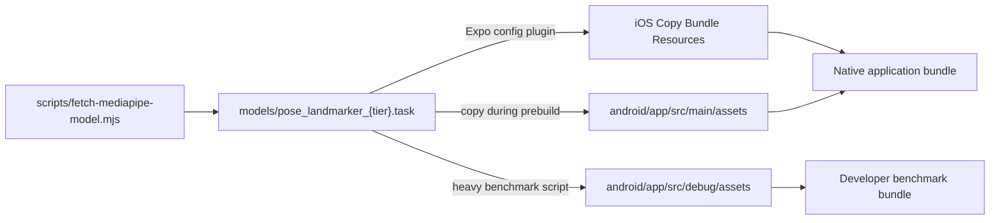

# Technology & Data

## Technology stack

Versions below come from `package.json`; a caret or tilde means the lockfile selects a compatible concrete version even though the manifest permits a range.

| Layer | Technology | Manifest version | Role |
|---|---|---:|---|
| Application framework | Expo | `~54.0.0` | Native project generation, Metro integration, permissions/plugins, EAS workflow |
| UI runtime | React | `19.1.0` | Component and hook model |
| Mobile runtime | React Native | `0.81.5` | iOS/Android application runtime; new architecture enabled |
| Language | TypeScript | `~5.9.2` | Strictly typed application and detector logic |
| Pose inference bridge | `react-native-mediapipe` | `^0.6.0` | MediaPipe Pose Landmarker live and image modes |
| Camera | `react-native-vision-camera` | `^4.7.3` | Camera device, format, preview, and frame processor |
| Drawing | `@shopify/react-native-skia` | `2.2.12` | Skeleton and retained game rendering |
| UI-thread state | `react-native-reanimated` | `~4.1.1` | Shared pose/game values and derived drawing state |
| Worklets | `react-native-worklets`, `react-native-worklets-core` | `0.5.1`, `^1.3.3` | Frame/UI worklet support |
| Local media | Expo Image Picker, Video, Video Thumbnails | `~17.0.11`, `~3.0.16`, `~10.0.8` | Developer clip selection, display, and frame sampling |
| Layout safety | `react-native-safe-area-context` | `~5.6.0` | Device inset-aware overlays |
| Unit testing | Jest, Babel Jest | `29.7.0` | Node-based pure logic and integration tests |
| Package manager | pnpm | Lockfile v10 / workspace patch | Reproducible dependencies and native package patching |
| Build service configuration | EAS | CLI `>=15.0.0` | Development, preview, and production build profiles |

## Pose model assets

The release constant in `src/pose-module/exercises/pushup.config.ts` selects the MediaPipe Full model. `models/pose_landmarker_full.task` is tracked at roughly 9 MB. A Heavy model of roughly 29 MB is also tracked for developer benchmarking, but source comments and the fetch script treat it as a debug-only candidate.

The model pipeline is:



`plugins/with-mediapipe-model.js` is fixed to the Full filename. Switching the compile-time tier therefore requires coordinating the model constant and native asset packaging; runtime model switching is intentionally unsupported.

## Core data model

```mermaid
erDiagram
    POSE_FRAME ||--|| SKELETON : contains
    POSE_FRAME ||--|| NORMALIZED_SKELETON : contains
    POSE_FRAME o|--|| WORLD_SKELETON : may_contain
    POSE_FRAME ||--|| JOINT_VISIBILITY : contains
    POSE_FRAME o|--|| FOOT_LANDMARKS : may_contain
    POSE_FRAME --> RENDER_POSE : derives
    POSE_FRAME --> EXERCISE_METRICS : derives
    EXERCISE_METRICS --> DETECTOR_UPDATE : advances
    DETECTOR_UPDATE --> POSE_SESSION : contributes

    POSE_SESSION ||--o{ REP_RESULT : contains
    REP_RESULT ||--o{ FORM_VIOLATION : contains
    DETECTOR_UPDATE ||--o{ HOLD : may_emit
    DETECTOR_UPDATE ||--o{ STEP_MEASUREMENT : may_emit
```

### Coordinate spaces

| Space | Units | Used for | Qualification |
|---|---|---|---|
| View | Preview pixels | Skeleton alignment, angles, lower-body X/Y movement | Depends on correct `ViewCoordinator` conversion |
| Normalized | Image-relative coordinates | Frame-boundary and proximity checks | Not a physical distance |
| World | MediaPipe body-relative 3-D coordinates | Push-up arm extension; optional shoulder-width estimate | Model estimate, optional for compatibility |
| Shoulder-width normalized | Dimensionless ratio | Velocities, lower-body travel, scale-independent thresholds | Reduces distance-to-camera sensitivity, not all projection effects |
| Time | Milliseconds | Refractory periods, gaps, holds, jump evidence, pyramid transitions | Live uses wall time; replay injects source-video timestamps into frame decisions |

## State ownership

| State | Storage | Lifetime |
|---|---|---|
| Raw result bundle | Callback argument | One processed frame |
| Filter/stabilizer/detector state | Class instances held in React refs | Mounted hook/session; reset selectively |
| Render pose and game signal | Reanimated shared values | Mounted hook |
| Counts, coaching, hold summaries | React state plus authoritative refs | Mounted hook/session |
| Performance samples | Fixed-size in-memory buffer | Reset when a session starts |
| Counter trace | Bounded in-memory array, opt-in | Reset when a session starts |
| `PoseSession` result | Callback value only | Caller-owned; not persisted by this shell |
| Replay asset and decoded thumbnail URI | Component/local media APIs | Replay screen/run |

## Data boundary and privacy-relevant behavior

The mounted application source invokes pose detection locally and contains no runtime fetch/API client. The replay path selects a local video and sends sampled local image paths to MediaPipe IMAGE mode. There is no application code to upload frames, landmarks, traces, or session results.

That observation is intentionally narrow:

- It does not prove properties of native operating-system services or transitive dependencies.
- It does not establish encryption, retention, regulatory compliance, or resistance to a compromised device.
- The replay implementation does not explicitly delete thumbnail cache files.
- EAS may receive source and build inputs during a cloud build; that is a build-system boundary, not a workout data flow.

A production privacy statement would require dependency review, platform storage inspection, a build/deployment data-flow assessment, and a documented retention policy.

## Configuration sources

Configuration is currently compile-time and source-controlled:

- `PUSHUP_PARAMS` centralizes push-up, confidence, rendering, subject-lock, model, and debug thresholds.
- `SQUAT_PARAMS` owns squat and jump thresholds.
- `BANDED_SIDE_STEP_PARAMS` owns lateral movement and hold thresholds.
- `performanceProfile.ts` owns Android camera and inference tiers.
- `pyramid.ts` owns level options, sequence helpers, and phase timing.
- `app.json` owns Expo identity, permissions, native plugins, and new-architecture setting.
- `eas.json` owns EAS profile shape.

No remote-config service or persisted per-device calibration is present. This makes behavior reproducible from source but requires a rebuild for threshold or feature-flag changes.

## Dormant game contract

`src/pose-module/games/signal.ts` defines four shared values for game consumers: normalized push-up position, mean confidence, person detection, and a wrist-motion proxy named `palmsPlanted`. It instructs renderers to interpolate lower-frequency pose updates on the UI thread and pause rather than punish the player after sustained detection loss.

Pure game mechanics for Flappy, Hauler, Knockout, and Race have Jest coverage. Their React Native scenes are not part of the shell's type-check include set and depend on missing host assets/services, so they should be treated as retained integration source—not a shipped capability.
