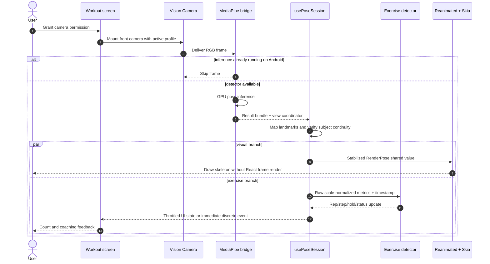
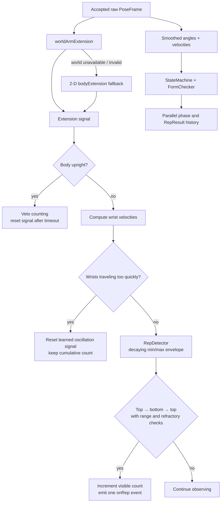
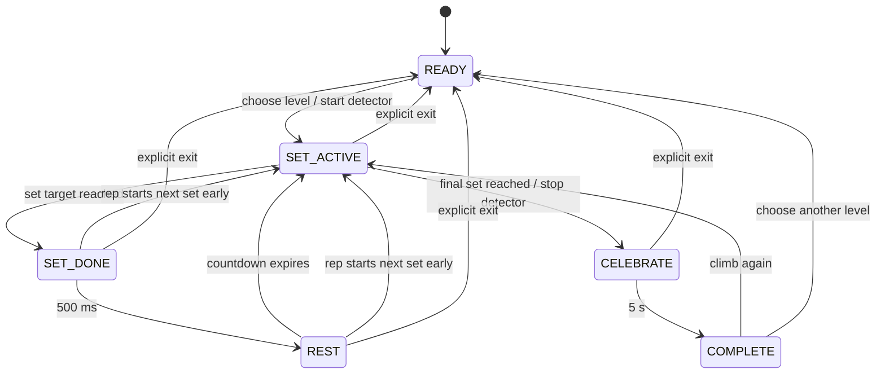
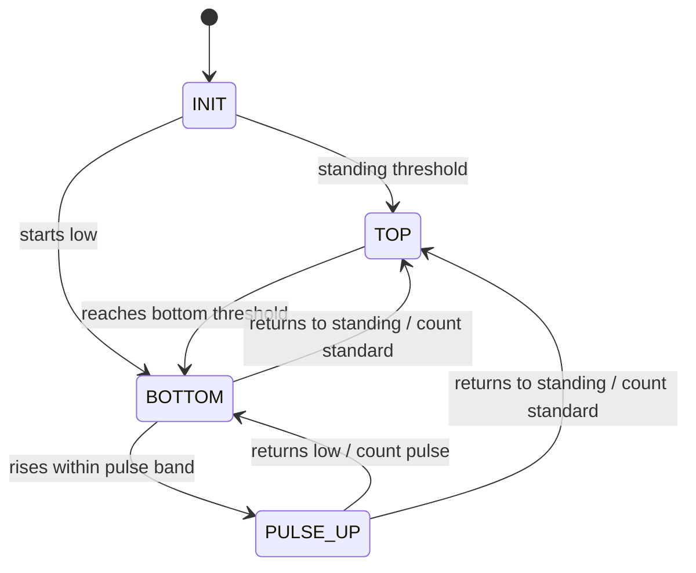
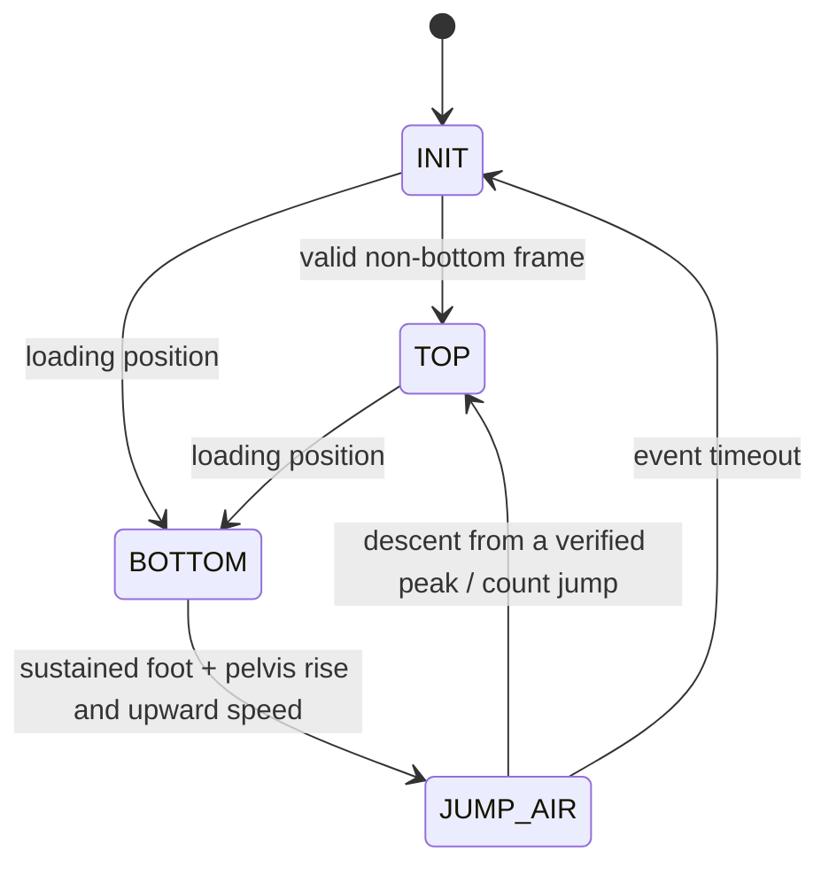
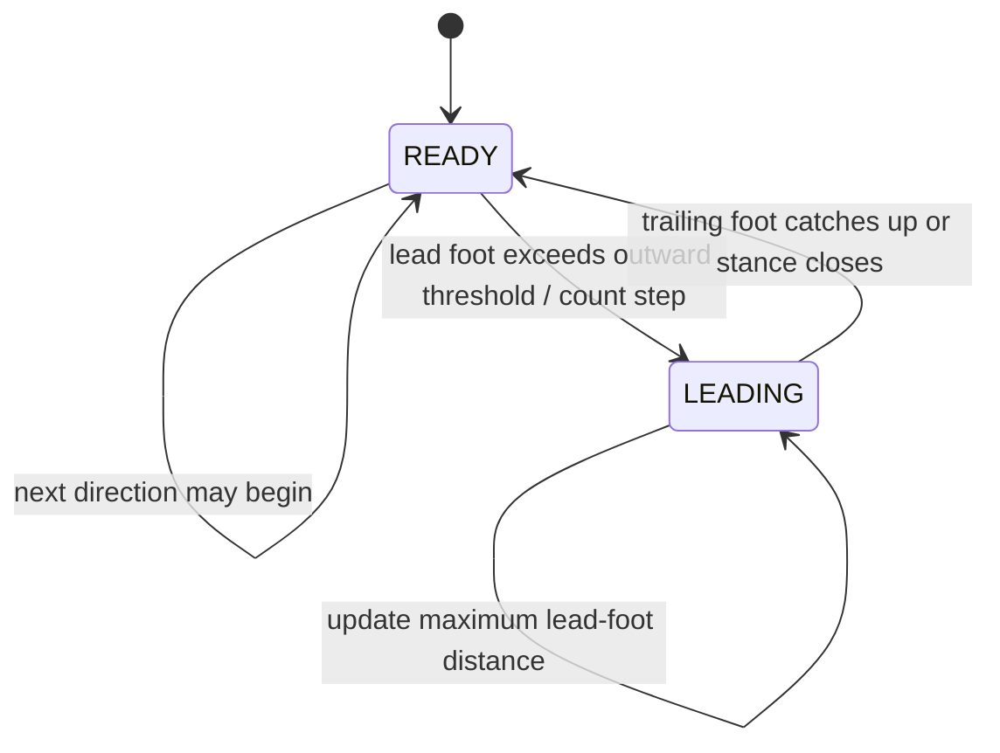
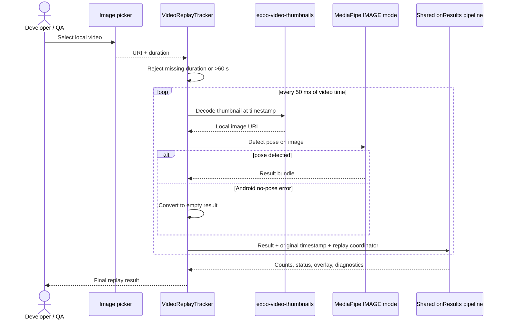

# Data Flows & Workflows

## Live camera flow

The native bridge is configured for one pose and a GPU delegate. A `ViewCoordinator` supplied by the bridge handles frame orientation, preview fit, and front-camera mirroring when converting landmark positions. Output orientation is forced to portrait, while camera/frame orientation remains available to the conversion layer.

## Shared pre-processing

Every accepted result follows the same initial path:

1. `toSkeleton` validates that 33 landmarks exist and constructs view, normalized, world, confidence, and foot structures.
2. `SubjectLock` accepts, rejects, or eventually relocks the pose using shoulder position and scale continuity.
3. Missing or rejected results increment a gap counter, clear the game-detection confidence, and feed a no-body frame into the visual stabilizer.
4. Accepted view landmarks are smoothed only for rendering and angle/form display.
5. Performance samples and processed-frame counts feed the Android tier evaluator.

After more than five consecutive missing frames, filter and velocity state is reset. The workout count itself is preserved; lower-body detectors pause after their tracking-gap allowance, and the UI asks the user to return to frame.

## Push-up counting flow

The primary signal is 3-D shoulder-to-wrist extension normalized by world shoulder width. A 2-D shoulder-to-wrist vertical gap remains as a compatibility fallback. The counter learns the athlete's current motion range instead of relying on one fixed elbow angle, because elbow confidence can collapse at the bottom of a push-up.

Two guards address false counts visible in the code's issue history:

- `isUprightExtended` rejects a standing body using knee/ankle span below the shoulders rather than a torso-angle assumption that fails with a floor-facing phone.
- Excessive wrist travel resets the oscillation envelope because crawling toward the phone can resemble a push-up depth cycle even though the hands are not planted.

The visible repetition count and `onRep` event come from `RepDetector`. A phase `StateMachine` and `FormChecker` run in parallel to build form-oriented `RepResult` objects. This dual mechanism is an explicit current behavior and creates a summary-alignment risk discussed under [limitations](limitations-and-roadmap.md#session-and-domain-semantics).

## Pyramid workflow

For level 3, the targets are `1, 2, 3, 2, 1`, totaling 9. For levels 4 and 5, totals are 16 and 25. The hook keeps fast-changing counters in refs and publishes phase state for the UI. A lightweight 100 ms ticker owns time-based transitions; repetition correctness remains in `usePoseSession`.

## Squat and jump-squat workflow

### Shared measurement

`measureSquat` requires shoulders, hips, knees, and ankles at the configured confidence level. It derives averaged knee angle, torso lean, pelvis position, stance width, ankle positions, lowest visible foot points, and a normalization width. Jump mode may use one visible side and a fallback scale based on hip/torso dimensions when the projected shoulder span collapses in a side view.

### Standard squat mode

A separate velocity condition recognizes a stable bottom hold. A brief grace window prevents a tiny movement from immediately ending the hold.

### Jump mode

Jump evidence is based on elapsed milliseconds, not a fixed number of frames. Heel/toe landmarks supplement ankles. Both feet normally contribute; when one foot is not reliable, a larger rise from the visible foot plus pelvis evidence can qualify. A count occurs on verified descent from a peak rather than requiring a clearly visible ground-contact frame.

## Side-step workflow and distance data

The baseline records both ankle X positions, the projected shoulder width, starting stance width, and optional world shoulder width. The direction multiplier is inferred from the anatomical ankle ordering, so a mirrored preview does not swap the meaning of left and right.

For each step, the current implementation stores:

- Direction and monotonically assigned step ID.
- Maximum lead-foot travel in projected shoulder widths (`distanceSW`).
- Approximate centimetres when world shoulder width is available.
- Session average and longest distance in shoulder-width units.

The shoulder-width value is the source of truth because it remains comparable as the athlete moves toward or away from the camera. The centimetre value inherits MediaPipe world-landmark estimation error and is not a calibrated tape measurement.

## Developer replay flow

The replay coordinate mapper uses `contain` geometry, including letterbox/pillarbox offsets, to align the skeleton with the video view. Frames are processed serially so asynchronous inference cannot reorder detector time. The code does not upload the clip. It also does not implement an explicit thumbnail-cache cleanup routine, so documentation should not claim secure deletion of decoder artifacts.

## Session output and in-memory data

When a session stops, `buildPoseSession` constructs an object with exercise ID, wall-clock duration, completion date, per-rep results, total/valid counts, average form score, and the three most frequent form errors. No mounted screen persists or transmits that object in this shell.

Live landmarks, render points, detector state, holds, step measurements, and performance samples reside in memory. The optional counter trace is capped at 180 entries and coalesces samples closer than 100 ms. It contains derived movement and status values; it deliberately excludes camera frames and raw landmark arrays.
